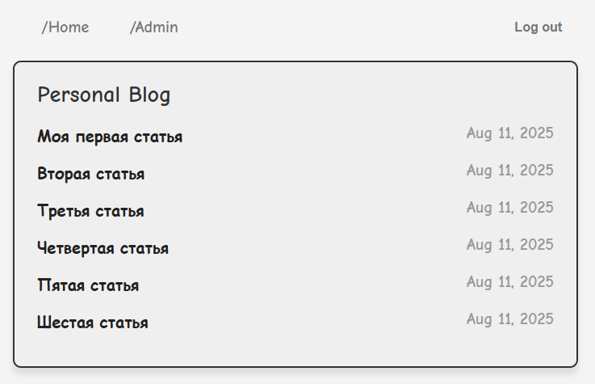
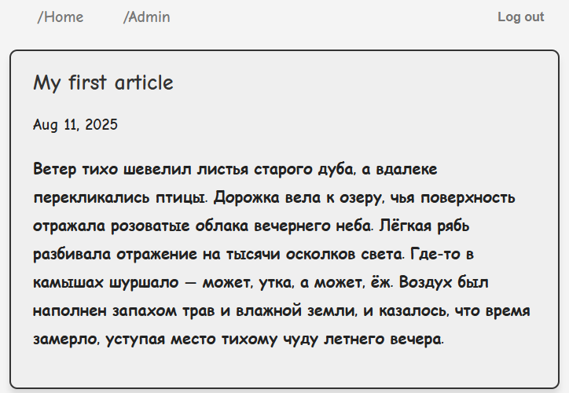

# Личный блог

Простой блог с доступом администратора для добавления и редактирования статей.  
Реализация идеи с сайта [roadmap.sh](https://roadmap.sh/projects/personal-blog).

  


## Особенности

- Доступ к списку статей и к отдельной статье для всех пользователей
- Доступ администратора для добавления, редактирования и удаления статей
- Аутентификация и авторизация в модальном окне, общение с бекендом через JSON
- Бекенд на Django
- Модальные окна на чистом JavaScript

## Структура проекта

```
personal-blog/
├── blog/               # Приложение с моделями, представлениями и шаблонами
├── static/             # Статические файлы (CSS, JS, изображения)
├── templates/          # HTML-шаблоны
├── personal_blog/      # Настройки проекта Django
├── manage.py
├── README.md
├── LICENSE
├── .gitignore
└── pyproject.toml      # Зависимости Python
```

## Технологии

- **Backend:** Django
- **Frontend:** HTML, CSS, JavaScript (чистый JS для модальных окон)
- **База данных:** SQLite (по умолчанию)
- **Формат обмена данными:** JSON для модальных окон

## Лицензия

Проект распространяется под лицензией MIT. Подробности — в файле [LICENSE](LICENSE).
